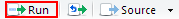
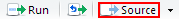

# Intro to R Lesson Plan
**Originally designed for a SWC session from August 31st - September 1st**

### Preamble

This repository contains all the material needed as well as a description and walkthrough of all the different topics that will be covered during the session.

### Obtaining Example Data Set

The inflammation data set that will be used during this lesson can be downloaded [here](http://swcarpentry.github.io/r-novice-inflammation/setup/).  After downloading the data create a new folder called `r-novice-inflammation`, unzip the file and move it into this newly created folder.  

*Alternatively, if you have `git` already installed and have a user profile you can also clone this repo and get the data set and this walkthrough with the following commands on the command line.*

`cd ~/Desktop`
<br>
`git clone https://github.com/marcsze/swc_introR_lessonStuff.git`

### Intro to RStudio

When we open up RStudio there are three panels the immediately appear
* The Console
* Environment/History (where you can see the data you load)
* Help/Directory/Vis

You can run commands directly on the console like you would in the `bash` command line.

```R
print("Hello World")
```
Alternatively, we can also run commands using a script.  To open a new script file in RStudio select the `File` tab and then hover over the `New File` and then select `R Script`.  This will open a fourth panel.  We can then write our commands in the script file and then have it run via the console.  There are a few different ways in which we can run commands from the script file.

1.  Use the run button to execute command on the same line as the cursor

2.  Use the source button to run the command (this will run all commands in your script)
  2. Add extra lines of code to show the difference between source and run  

3. You can use `ctrl` + `enter` to run the command on the line of the cursor as well.

4. You can also quickly source all of your code with `ctrl` + `shift` + `s` 


A few extra short cuts that could be helpful for switching between the console and script windows
* `ctrl` + `1` will move you from the console to the script
* `ctrl` + `2` will move you from the script to the console

Another important thing that we can do in the script file that is not easy to do in the console is to comment our code using the `#` button.  This tells the computer to ignore everything on this line.

What happens when you send incomplete code to the console to run?
```R
print("Hello World"
```
Try it out.  You should see a `+` sign appear.  R is smart enough to know that you are missing something in your code and is waiting for you to add it.  Cool right?  You can escape the `+` sign by pressing `Esc`.  Now that we've gotten a good feel for the RStudio program lets get started with some commands now...


### Analyzing Patient Data

I'm going to use the script panel for most of the rest of the lesson (need to make sure to enlarge the view with `ctrl` + `shift` + `+`).

Main parts covered during this component include:
* Loading Data
* Variable assignment
    * can use `Alt` + `-` to quickly bring up arrow used for assignment
*  Commenting examples
*  Basic data manipulation
*  How to bring up help for each function
*  Basic apply usage
    * alternative include `rowMeans` and `colMeans`
* Basic Plotting

#### Loading Data

We can get an idea of our current working directory by typing in 

```R
getwd()
```
Since we downloaded and unzipped our file into a folder on the Desktop to make things easier on us this morning we will set the directory to which RStudio will initially be in with:

```R
setwd("~/Desktop/r-novice-inflammation/")
```
We can then read a csv file using the following command:

```R
read.csv(file = "data/inflammation-01.csv", header = FALSE)
```

Segway class into two observations that happened from running this command.
  * First bring up the Need to go over the options for `read.csv` (header and other types of decimal formats)
      * initial intro to the the help functionality of R
  * Second bring up that everything was read to the console (not very useful)

  
#### Variable assignment

Variable can be thought of as name for a value.  The neat thing is that it can be stored for future use (assign a variable and then show that it will appear in the Environment pane).

* Cover assignment (kilogram weight)
* Cover arithmetic (kg to pound with 2.2 multiplication)
* If not already mentioned highlight utility of the `up` arrow

#### Commenting examples

* Go over how to use comments to make code easier to understand
    * Change the kg weight variable to new number
    * Add a new variable for weight in pounds
    * Change the kg weight to highlight how variables store the info
    * highlight use of parenthesis
    * Use the `read.csv` function along with variable assignment to store data as `dat`
        * can use the command `head` to view data in console (ask how you would bring up the data then bring up `head`)

Create a `mass` and `age` variable and get class to explain what happens when the arguments
* `mass <- mass * 2.0` 
* `age <- age - 20`


#### Manipulating Data

Basic data table parsing
* Go over the `class` function (type of data table being used)
* `dim` to get total rows and columns
* how to get a specific value in a data table with row and column number
    * Try a view differnt examples
* How to bring up a specific range of rows and columns
    * have them try to get a different range (e.g. rows 5-10 and columns 4-7)
* show the use of `c()` to get non-continuous rows and columns from data table
    * Get them to try commands without filling in the row or column e.g. `data[, 5]` 
      * Ask them what they think will happen

Doing some calculations
* assign variable to a whole row
* use the `max()` function to get the highest value
    * Important to note that can use `as.numeric` and `class` to view how data is stored
* show the same thing but without variable storage
* use `min()`, `mean()`, `median()`, `sd()`
  * mention that this is good for one at a time but really want to apply to all the data table
* Re-Introduce the help function by using it on `apply()`
* Use `apply()` to get values by row (1) or column(2)

```R
# get average by row
avg_patient_inflammation <- apply(dat, 1, mean)
avg_day_inflammation <- apply(dat, 2, mean)
```

Finally, explain how R is filled with functions that have more efficient alternatives e.g. `colMeans` and `rowMeans`.

Questions
* Get class to create a variable called animal (go over how RStudio automatically completes quotes)
```R
animal <- c("m", "o", "n", "k", "e", "y")
```
    * remind about selecting specific parts of the vector 
    * how to get reverse order (`animal[4:1]`)
    * what does `animal[-1]` or `animal[-4]` do?
    * spell new word "eon" (`animal[c(5,2,3)]`)

* How would you get the max inflammation from patient 5 for days 3-7 (`max(dat[5, 3:7])`)

* Using the inflammation data frame dat from above: Let’s pretend there was something wrong with the instrument on the first five days for every second patient (#2, 4, 6, etc.), which resulted in the measurements being twice as large as they should be
  * Write a vector with each affected patient (hint use `seq(from, to, by)`)
  * Create new data from in which you halve the 1st five values in only those patients
  * print new data table to check
  * Mention in solution how R is vectorized so it will do the division for all values

*One possible solution*
```R
whichPatients <- seq(2, 40, 2)
whichDays <- c(1:5)
dat2 <- dat
dat2[whichPatients, whichDays] <- dat2[whichPatients, whichDays]/2
(dat2)
```

* Use the apply function to 
  * get mean over 40 days for patient 1-5 (`apply(dat[1:5, ], 1, mean)`)
  * mean for days 1 - 10 for all patients (`apply(dat[, 1:10], 2, mean)`)
  * mean for every second day for all patients (`apply(dat[, seq(1,40,2)], 2, mean)`)
  * Are there any alternative methods the class can think of?


#### Plotting

* Go over base `plot()` function with `avg_day_inflammation` 
* Go over plotting only the `max()` day inflammation 
* Go over plotting only the `min()` day inflammation (ask class how they would do this)

Questions
How would you plot the SD for the inflammation data for each day across all patients
`plot(apply(dat, 2, sd))`


### Creating Functions

